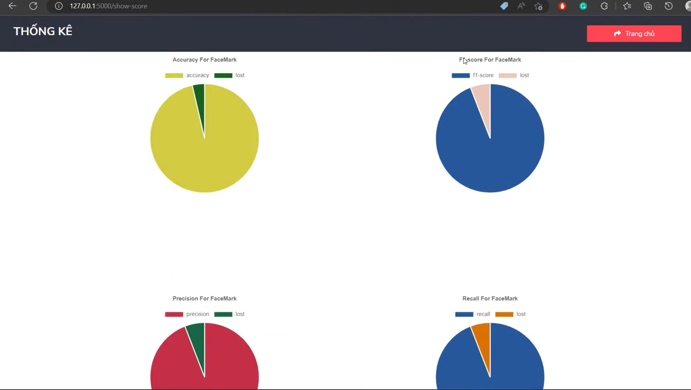
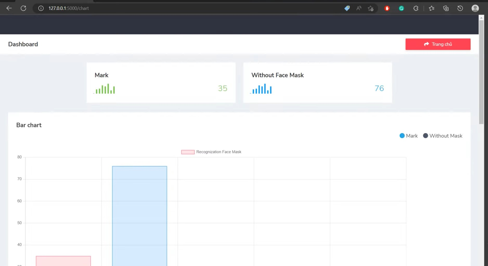

# yolov4-facemask
## I build model to api.

## The database is on FIREBASE.

## The Web allow user validate the accuracy of predicting label. Now, I just save image and file label (label, x,y,w,h) when the confidence >0.9.

## From this, you can think this project also has auto label for facemask.

## Demo: 

## This is main Web:

## Beside that, I have darknet.exe file, it was built, that may help you check your computer's frame rate.
## And the code client I just call API, but run on Winform.
# This project also have Data Visualization.

## This is model core page:

## This is report page:

For example: 
+ Show score of Confusion Matrix vs Validating Score (Accuracy,F1,...)
+ Num of With mask and No Mask in database,....

# Requirement

* CUDA vs CUDNN for using GPU (I use 11.4 vs 8.2.4)
# Notice

Any thing you have to do: Extract all file need.rar in need folder and copy all from that to the folder(gpu/cpu) that you can run.
# How to run: on GPU or on CPU

## Two way to run: use darknet and use build API

# +For Darknet

## With CPU
#for image

darknet_no_gpu.exe detector test data/obj.data cfg/yolov4.cfg Model/yolov4-custom_best.weights ../image/demo.png

#for video

darknet_no_gpu.exe detector demo data/obj.data cfg/yolov4.cfg Model/yolov4-custom_best.weights ../video/video.mp4 -out_filename ../video/output.mp4

#camera

darknet_no_gpu.exe detector demo data/obj.data cfg/yolov4.cfg Model/yolov4-custom_best.weights

## With GPU

You just replace darknet_no_gpu.exe to darknet.exe

# -For API

On gpu dir, you can see $api.py$, $backup.py$, $client.py$ vs $newway.py$

## If you don't have GPU, run "backup" file, else see how to active opencv using GPU, run "new" file.

* $backup.py$: File API on CPU
* For $newway.py$: API on GPU
* Darknet.exe: tool of darknet for testing yolo model
* $client.py$: winform
* $app.py: run on web
* $conMatrix.py: class for using Validating Score

# This is my training: 
